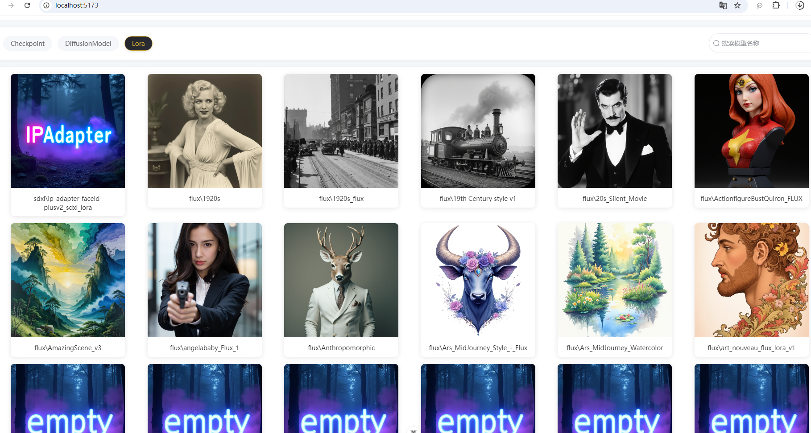

# AI 模型管理器
## 功能介绍
在使用 ComfyUI 的过程中，下载了很多的 checkpoint / diffusion_model / lora 模型，随着时间的发展，已经无法分清每一个模型的效果和使用建议（比如触发词）了。于是需要这样一个东西，可以展示模型的三要素：
1. 缩略图：直观的查看模型的作用和效果，这个图需要支持我自己选择
2. 使用建议：包含触发词/推理参数/ 模型作者的一些生图建议（比如起手式）
3. 下载链接：通过该链接可以看看本模型的一些最新进展，比如作者是否发布了更新的模型

网上搜索了 ComfyUI 模型管理的插件，要不就是功能冗余，要不就是功能残缺，均不能满足上述的小而美的需求，故开发了该项目。



点击模型：


## 工程
服务端工程：https://github.com/zhaojigang/model-preview

前端工程：https://github.com/zhaojigang/model-preview-front

## 使用方式

### 模型放置位置

模型目录必须如下（以 loras 为例，其余两个也是一样）：
```
ComfyUI\models\loras        -- 一级目录
- flux\                     -- 二级目录：存放 flux 模型
  - 1920s.safetensors       -- 模型
  - 1920s.png               -- 模型缩略图
  - 1920s_使用说明.txt       -- 模型使用说明文档
  - 1920s_下载地址.txt       -- 模型使用下载地址
- sdxl\                     -- 二级目录：存放 sdxl 模型
- sd15\                     -- 二级目录：存放 sd15 模型
- pony\                     -- 二级目录：存放 pony 模型
```
说明：
* 文件命名规则：
  - 缩略图：模型名.png
  - 使用文档：模型名_使用说明.txt，放置说明文案
  - 下载地址：模型名_下载地址.txt，放置一个 https 链接，例如，https://civitai.com/models/475506/1920s-fluxsdxl
* 一级目录支持：checkpoints / diffusion_models / loras
* 二级目录支持：flux / sdxl / sd15 / pony
* 为了规范模型放置，方便后续使用，模型必须放置在对应的目录中，直接放在一级目录里的不会读取
* 模型的使用说明空文件和下载地址空文件会在首次访问模型管理界面的时候自动进行创建，后续新增模型后，只要访问模型管理界面，也会自动创建。

### 模型管理器启动
服务端启动：克隆项目，在项目根目录下执行 `mvn clean install`，之后再 target 目录下找到 jar 包。
执行 `java -jar jar包`

前端启动：克隆项目，在根目录下执行 `npm run dev`，之后根据执行日志，进行浏览器访问即可
